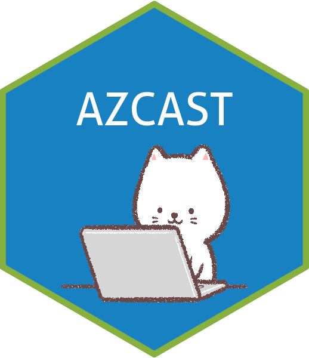
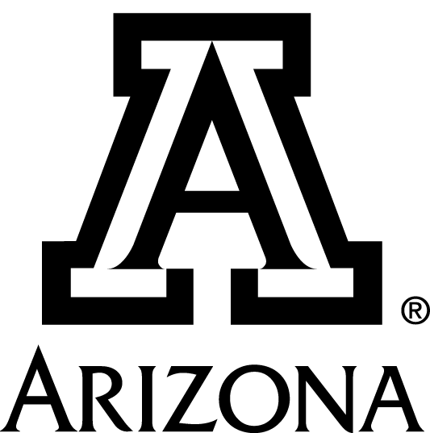

<!-- README.md is generated from README.Rmd. Please edit that file -->

```{r setup, include = FALSE}
knitr::opts_chunk$set(
  collapse = TRUE,
  comment = "#>",
  fig.path = "man/figures/README-",
  out.width = "100%"
)

library(badger)
repo <- "ryanstraight/azcast"
```

# azcast 

<!-- badges: start -->
`r badge_last_commit(repo)`
`r badge_lifecycle("experimental", "orange")`


[](https://github.com/ryanstraight/azcast/actions/workflows/pkgdown.yaml)
[](https://github.com/ryanstraight/azcast/actions/workflows/update-citation-cff.yaml)
[](https://github.com/ryanstraight/azcast/actions/workflows/pages/pages-build-deployment)
<!-- badges: end -->

The `azcast` R-package is a utility package with consolidated tools and templates prepared for the University of Arizona's College of Applied Science and Technology. It contains a variety of templates that I have been using and tweaking for some time, as well as new-to-me templates from the wonderful `numbats/monash` package. A good amount of the original Monash content is still here and will be altered or removed as appropriate. The package is mainly templates and easy access to assets like logos and colors.

## Package Details

### Installation

`azcast` is not on CRAN, so you need to install it from this repository. You can install the `azcast` R-package like this:

``` r
# install.packages("remotes")
remotes::install_github("ryanstraight/azcast")
```

### Templates

One of the core functions of this package is to easily create branded documents.

+ Exam: a paper exam. [Example](/inst/rmarkdown/templates/exam/skeleton/skeleton.pdf)
+ Letter: letter with CAST banner at top left. [Example](/inst/rmarkdown/templates/letter/skeleton/skeleton.pdf)
+ Memo: a casual memo with optional branding. [Example](/inst/rmarkdown/templates/memo/skeleton/skeleton.pdf)
+ Report: for reports sent to external clients. [Example](/inst/rmarkdown/templates/report/skeleton/skeleton.pdf)
+ Working paper: a mask-able working paper template. [Example](/inst/rmarkdown/templates/working-paper/skeleton/skeleton.pdf)
+ Xaringan: a themed Xaringan slide deck.

(The original `monash` package includes theses templates. These were not updated and included in this package. Using [kelseygonzalez/beardown: An updated R Markdown thesis template using the bookdown package for University of Arizona](https://github.com/kelseygonzalez/beardown) is preferred.)

### Get a University of Arizona logo

You can get a copy of the logo into the directory you wish using the `logo_get()` function:

``` r
# default logo
azcast::logo_get()
# monochrome block version of the logo
azcast::logo_get(color = "black", style = "block")
```

And then you can reference the logo file that you copied.

#### Logo examples




You'll notice these are high resolution and thus pretty large. You are encouraged to use the `knitr` function `include_graphics()` rather than the standard `` markdown image syntax. This allows you to easily resize the figures, like so:

```{r logo-resize-example, echo=TRUE, out.width="10%", fig.cap="A smaller logo."}

```


### Get University of Arizona Brand colors

These are handy commands to quickly see University of Arizona brand colors and be able to copy-and-paste the hex color codes. You can find more info like `cmyk`, `rgb`, and `Pantone` codes and formulas here: [Colors | University of Arizona Brand Resources](https://brand.arizona.edu/applying-the-brand/colors)

```{r colors}
azcast::color_show()
```

The `xaringan` themed slide deck mentioned in the template list above employs heavy use of these colors, as you can imagine.

### Settings

(WIP) The azcast package makes use of some values, listed below, from your R profile. 
You can modify this by using `usethis::edit_r_profile()` and adding below with 
values modified to your own values. 

```
options(azcast.full_name = "Dr. Ryan Straight",
        azcast.email = "ryanstraight@arizona.edu",
        azcast.orgunit = "College of Applied Science and Technology",
        azcast.teaching_dir = "~/teaching/azcast/",
        azcast.workshop_dir = "~/workshop/")
```

## University of Arizona

*Information about the university follows.*

>The University of Arizona, a land-grant university with two independently accredited medical schools, is one of the nation's top 40 public universities, according to U.S. News & World Report. Established in 1885, the university is widely recognized as a student-centric university and has been designated as a Hispanic Serving Institution by the U.S. Department of Education. The university ranked in the top 20 in 2019 in research expenditures among all public universities, according to the National Science Foundation, and is a leading Research 1 institution with $734 million in annual research expenditures. The university advances the frontiers of interdisciplinary scholarship and entrepreneurial partnerships as a member of the Association of American Universities, the 65 leading public and private research universities in the U.S. It benefits the state with an estimated economic impact of \$4.1 billion annually. For the latest on the University of Arizona response to the novel coronavirus, visit the university's [COVID-19 webpage](https://covid19.arizona.edu/).

### The College of Applied Science and Technology (CAST)

> The College of Applied Science & Technology (CAST) provides opportunities for students to earn high-quality and meaningful University of Arizona degrees at sites throughout Southern Arizona, including key border communities in Cochise and Santa Cruz Counties. CAST partners with community colleges to offer regionally-relevant transfer programs that are low cost, and geographically accessible.
> 
> Students can choose from Bachelor of Applied Science programs, select Master’s programs, and a variety of continuing education programs designed to meet the workforce needs of area industry.
> 
> ~[About | AZCAST](https://azcast.arizona.edu/about)

### Our Values

Who we are and what we stand for:

**INTEGRITY** Be honest, respectful and just.  
**COMPASSION** Choose to care.  
**EXPLORATION** Be insatiably curious.  
**ADAPTATION** Stay open-minded and eager for what's next.  
**INCLUSION Harness** the power of diversity.  
**DETERMINATION** Bear Down.


### Land Acknowledgment

>We respectfully acknowledge the University of Arizona is on the land and territories of Indigenous peoples. Today, Arizona is home to 22 federally recognized tribes, with Tucson being home to the O’odham and the Yaqui. Committed to diversity and inclusion, the University strives to build sustainable relationships with sovereign Native Nations and Indigenous communities through education offerings, partnerships, and community service.
