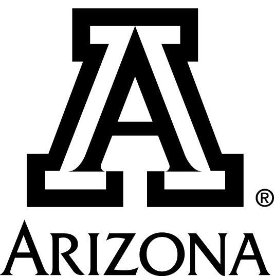

<!-- README.md is generated from README.Rmd. Please edit that file -->

# azcast 

<!-- badges: start -->

[](https://github.com/ryanstraight/azcast/commits/main)
[](https://lifecycle.r-lib.org/articles/stages.html#experimental)


[](https://github.com/ryanstraight/azcast/actions/workflows/pkgdown.yaml)
[](https://github.com/ryanstraight/azcast/actions/workflows/update-citation-cff.yaml)
[](https://github.com/ryanstraight/azcast/actions/workflows/pages/pages-build-deployment)
<!-- badges: end -->

**Work in progress! Don’t be surprised if things are wonky.**

The `azcast` R-package is a utility package with consolidated tools and
templates prepared for the University of Arizona’s College of Applied
Science and Technology. It contains a variety of templates that I have
been using and tweaking for some time, as well as new-to-me templates
from the wonderful `numbats/monash` package. The package is mainly
templates and easy access to assets like logos and colors. The goal is
for this to be useful not just for me, but for others in CAST, whether
they be faculty, staff, or students.

**Please note that these are *my personal templates* and not “official”
by any means.**

These templates will be tweaked and updated as time goes on and as my
personal tastes change. I hope folks find it useful!

## Package Details

### Installation

`azcast` is not on CRAN, so you need to install it from this repository.
You can install the `azcast` R-package like this:

``` r
# install.packages("remotes")
remotes::install_github("ryanstraight/azcast")
```

### Templates

One of the core functions of this package is to easily create branded
documents. (Ironically, the *functions* aren’t working right now, but
you can still create files using the RMarkdown tempaltes. You can see
these steps in [the
vignette](https://ryanstraight.github.io/azcast/articles/template.html).)
You are *highly* encouraged to use the
[`tinytex()`](https://yihui.org/tinytex/) package as your LaTeX
environment. When knitting these templates for the first time, please be
patient as packages are installed.

-   `Class paper`: no template provided; when APA is required, use the
    **[papaja](https://github.com/crsh/papaja)** package. Otherwise, use
    `document`.
-   `Exam`: a paper exam.
    [Example](https://github.com/ryanstraight/azcast/blob/master/inst/rmarkdown/templates/exam/skeleton/skeleton.pdf)
    -   While unlikely to be used all that often, who knows, it may come
        in handy at some point.
-   `Document`: all-purpose document based on the
    [svmiller/stevetemplates](https://github.com/svmiller/stevetemplates)
    `statement` template.
    [Example](https://github.com/ryanstraight/azcast/blob/master/inst/rmarkdown/templates/document/skeleton/skeleton.pdf)
    -   This is a good template for assignments that don’t require APA
        formatting.
-   `Letter`: letter with CAST banner at top left.
    [Example](https://github.com/ryanstraight/azcast/blob/master/inst/rmarkdown/templates/letter/skeleton/skeleton.pdf)
    -   Note the `\newline` requirement in the to-address.
-   `Memo`: a casual memo with optional branding.
    [Example](https://github.com/ryanstraight/azcast/blob/master/inst/rmarkdown/templates/memo/skeleton/skeleton.pdf)
-   `Report`: for reports sent to external clients.
    [Example](https://github.com/ryanstraight/azcast/blob/master/inst/rmarkdown/templates/report/skeleton/skeleton.pdf)
-   `Thesis`: no template is provided; use **[kelseygonzalez/beardown:
    An updated R Markdown thesis template using the bookdown package for
    University of Arizona](https://github.com/kelseygonzalez/beardown)**
    instead.
-   `Working paper`: a mask-able working paper template.
    [Example](https://github.com/ryanstraight/azcast/blob/master/inst/rmarkdown/templates/working-paper/skeleton/skeleton.pdf)
-   `Xaringan`: a themed Xaringan slide deck. [Deck code
    example](https://github.com/ryanstraight/ac21-postphenom) and [the
    published deck](https://ryanstraight.github.io/ac21-postphenom/#1).
    -   The slide deck template *heavily* employs the
        [`xaringanExtra`](https://pkg.garrickadenbuie.com/xaringanExtra/)
        package and attempts to demonstrate virtually all functions and
        options possible within the template file. If you’re unfamiliar
        with Xaringan, see the [GitHub repository and documented linked
        therein](https://github.com/yihui/xaringan).
    -   Fun fact: the `Infinite Moon Reader` live edit/preview Add-In
        that comes with Xaringan works for any Rmd file, not just the
        slide decks.

### Get a logo

You can get the CAST webheader like this:

``` r
# any webheader you like as long as it's this one
azcast::logo_get_cast()
```

You can get a copy of the official University of Arizona logo into the
directory you wish using the `logo_get()` function. See the vignette for
more info on how to use this.

``` r
# default logo
azcast::logo_get()
# monochrome block version of the logo
azcast::logo_get(color = "black", style = "block")
```

You can then reference the logo file that you copied.

#### Logo examples





You’ll notice these are high resolution and thus pretty large. You are
encouraged to use the `knitr` function `include_graphics()` rather than
the standard `` markdown image syntax. This allows you to
easily resize the figures. For example, the following uses chunk options
`out.width=10%` and `fig.cap="A smaller logo."` You can learn more about
R code chunks at [Options - Chunk options and package options - Yihui
Xie \| 谢益辉](https://yihui.org/knitr/options/).

``` r
knitr::include_graphics("man/figures/banner.png")
```


### Get University of Arizona Brand colors

These are handy commands to quickly see University of Arizona brand
colors and be able to copy-and-paste the hex color codes. You can find
more info like `cmyk`, `rgb`, and `Pantone` codes and formulas here:
[Colors \| University of Arizona Brand
Resources](https://brand.arizona.edu/applying-the-brand/colors)

``` r
azcast::color_show()
```


    #> arizonablue  arizonared        leaf       river      silver        mesa 
    #>   "#0C234B"   "#AB0520"   "#70B865"   "#007D84"   "#9EABAE"   "#A95C42" 
    #>       bloom         sky       oasis       chili     azurite    midnight 
    #>   "#EF4056"   "#81D3EB"   "#378DBD"   "#8B0015"   "#1E5288"   "#001C48" 
    #>       black       white    warmgray    coolgray 
    #>   "#000000"   "#FFFFFF"   "#F4EDE5"   "#E2E9EB"

The `xaringan` themed slide deck mentioned in the template list above
employs heavy use of these colors, as you can imagine.

### Settings

(WIP) The azcast package makes use of some values, listed below, from
your R profile. You can modify this by using `usethis::edit_r_profile()`
and adding below with values modified to your own values.

    options(azcast.full_name = "Dr. Ryan Straight",
            azcast.email = "ryanstraight@arizona.edu",
            azcast.orgunit = "College of Applied Science and Technology",
            azcast.teaching_dir = "~/teaching/azcast/",
            azcast.workshop_dir = "~/workshop/")

### Building the hex sticker

If for any reason you’d need to, you can build the hex sticker (the
`azcast` R package logo above) by forking the repository and using this
script:

``` r
#library(hexSticker)
#library(here)

imgloc <- here::here("man", "figures", "cat.png")

sticker(imgloc, package="AZCAST", p_size=20, s_x=1, s_y=.75, h_fill="#0C234B", h_color="#8B0015", s_width=.6, p_family = "Aller_Rg", filename="man/figures/logo.png")
```

## University of Arizona

*Sundry information about the university follows.*

> The University of Arizona, a land-grant university with two
> independently accredited medical schools, is one of the nation’s top
> 40 public universities, according to U.S. News & World Report.
> Established in 1885, the university is widely recognized as a
> student-centric university and has been designated as a Hispanic
> Serving Institution by the U.S. Department of Education. The
> university ranked in the top 20 in 2019 in research expenditures among
> all public universities, according to the National Science Foundation,
> and is a leading Research 1 institution with $734 million in annual
> research expenditures. The university advances the frontiers of
> interdisciplinary scholarship and entrepreneurial partnerships as a
> member of the Association of American Universities, the 65 leading
> public and private research universities in the U.S. It benefits the
> state with an estimated economic impact of $4.1 billion annually. For
> the latest on the University of Arizona response to the novel
> coronavirus, visit the university’s [COVID-19
> webpage](https://covid19.arizona.edu/).

### The College of Applied Science and Technology (CAST)

> The College of Applied Science & Technology (CAST) provides
> opportunities for students to earn high-quality and meaningful
> University of Arizona degrees at sites throughout Southern Arizona,
> including key border communities in Cochise and Santa Cruz Counties.
> CAST partners with community colleges to offer regionally-relevant
> transfer programs that are low cost, and geographically accessible.
>
> Students can choose from Bachelor of Applied Science programs, select
> Master’s programs, and a variety of continuing education programs
> designed to meet the workforce needs of area industry.
>
> \~[About \| AZCAST](https://azcast.arizona.edu/about)

### Our Values

Who we are and what we stand for:

**INTEGRITY** Be honest, respectful and just.  
**COMPASSION** Choose to care.  
**EXPLORATION** Be insatiably curious.  
**ADAPTATION** Stay open-minded and eager for what’s next.  
**INCLUSION Harness** the power of diversity.  
**DETERMINATION** Bear Down.

### Land Acknowledgment

> We respectfully acknowledge the University of Arizona is on the land
> and territories of Indigenous peoples. Today, Arizona is home to 22
> federally recognized tribes, with Tucson being home to the O’odham and
> the Yaqui. Committed to diversity and inclusion, the University
> strives to build sustainable relationships with sovereign Native
> Nations and Indigenous communities through education offerings,
> partnerships, and community service.
