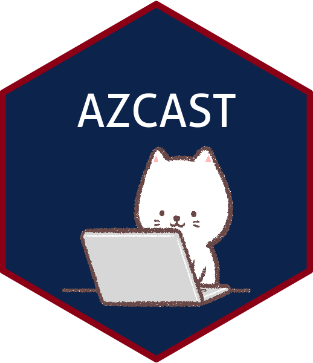

```{r setup, include = FALSE}
knitr::opts_chunk$set(
  echo = FALSE,
  out.width = "100%"
)
```

Here is where you type your memo.

You can add photos:

```{r image, echo=FALSE, out.width="15%"}

```

And you can add R figures and graphs.

```{r hist, echo=FALSE, out.width="20%"}
hist(mtcars$mpg)
```

# Headers

Don't forget your headers. `r lorem::ipsum(paragraphs = 3, sentences = c(6, 12, 4))`.

